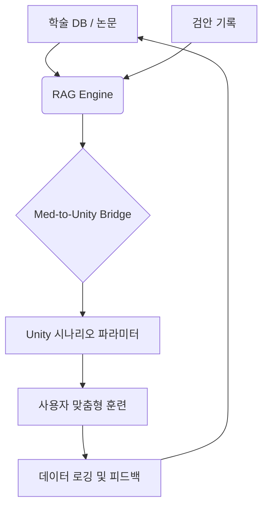

- # EyeTracker 구현계획서 (Implementation Plan)
- 본 문서는 문제정의서에서 도출된 해결책을 실제 구현하기 위한 기술적 단계와 파라미터를 정의합니다.

- 대주제: EyeTracker Phase 1 상세 구현 단계 (by /mine1)
    - 소주제: 단계별 메인 로직 및 파라미터 매핑
        - 세부사항: 0.01 단계: 개발 환경 및 AR 인프라 초기화
            - 세부사항: 메인 로직: Unity 2024 LTS 설치 및 AR Foundation, ARKit/ARCore 플러그인 통합
            - 세부사항: 파라미터: Universal Render Pipeline (URP), SDK Level 33+, Multithreaded Rendering
            - 세부사항: 구현 가능성: 100퍼센트
        - 세부사항: 0.02 단계: 실시간 시선 벡터 추출 모듈 구현
            - 세부사항: 메인 로직: 스마트폰 전면 카메라를 통한 시선 방향(Gaze Direction) 실시간 캡처 및 정규화
            - 세부사항: 파라미터: Gaze Origin, Gaze Direction Vector, Face Mesh Topology
            - 세부사항: 구현 가능성: 90퍼센트
        - 세부사항: 0.03 단계: 시선 데이터 정밀 안정화 알고리즘
            - 세부사항: 메인 로직: 칼만 필터(Kalman Filter)를 적용하여 시선 데이터의 미세 떨림(Jitter) 보정
            - 세부사항: 파라미터: Process Noise Covariance (Q), Measurement Noise Covariance (R)
            - 세부사항: 구현 가능성: 85퍼센트
        - 세부사항: 0.04 단계: 메타버스 평야 및 3D 타겟(열기구) 환경 구축
            - 세부사항: 메인 로직: 원근감을 극대화한 평야 환경 및 시선 반응형 3D 열기구 타겟 배치
            - 세부사항: 파라미터: Skybox Atmos, Balloon Transform, Horizon Height
            - 세부사항: 구현 가능성: 100퍼센트
        - 세부사항: 0.05 단계: 디옵터 기반 원근 조절(Accommodation) 엔진 설계
            - 세부사항: 메인 로직: 학술 데이터를 기반으로 열기구(타겟)의 Z축 거리를 실시간 가변 제어
            - 세부사항: 파라미터: Diopter (0.5D ~ 5.0D), Unity Z-Distance (0.2m ~ 2.0m)
            - 세부사항: 구현 가능성: 80퍼센트
        - 세부사항: 0.06 단계: 양안 협응 및 폭주(Convergence) 알고리즘 적용
            - 세부사항: 메인 로직: 시선 거리에 따른 가상 카메라의 내전(Inward) 각도 및 타겟 위치 미세 조정
            - 세부사항: 파라미터: Interpupillary Distance (IPD), Convergence Angle (최대 50도)
            - 세부사항: 구현 가능성: 75퍼센트
        - 세부사항: 0.07 단계: 의학적 세이프가드 및 훈련 중단 시스템
            - 세부사항: 메인 로직: 과도한 수렴이나 근거리 응시 감지 시 화면 블러 또는 일시 중지 처리
            - 세부사항: 파라미터: Min Distance Threshold (15cm), Continuous Gaze Limit
            - 세부사항: 구현 가능성: 95퍼센트
        - 세부사항: 0.08 단계: RAG 피드백 루프 및 데이터 로깅 모듈 완성
            - 세부사항: 메인 로직: 사용자 응시 데이터와 교정 성과를 Firebase에 저장하고 RAG 난이도 최적화에 반영
            - 세부사항: 파라미터: Gaze Success Ratio, Session Duration, Firebase Cloud
            - 세부사항: 구현 가능성: 90퍼센트
        - 세부사항: 0.09 단계: 신경 가소성 가보 패치(Gabor Patch) 생성 엔진
            - 세부사항: 메인 로직: 시각 피질 자극을 위한 수학적 가보 패턴 실시간 렌더링 및 파라미터 제어
            - 세부사항: 파라미터: Spatial Frequency (CPD), Orientation, Gaussian Envelope Size
            - 세부사항: 구현 가능성: 85퍼센트
        - 세부사항: 0.10 단계: 적응형 대비 임계값(Adaptive Contrast) 트래킹 시스템
            - 세부사항: 메인 로직: 사용자의 인식 성공률에 따라 실시간으로 타겟 대비(Contrast)를 자동 조정
            - 세부사항: 파라미터: Contrast Ratio (0.01 ~ 1.0), Success Threshold (80%)
            - 세부사항: 구현 가능성: 80퍼센트
        - 세부사항: 0.11 단계: 양안 억제 제어용 Dichoptic 훈련 로직
            - 세부사항: 메인 로직: 각 눈에 독립적인 시각 자극(대비 차등화)을 부여하여 약시 및 억제 현상 개선
            - 세부사항: 파라미터: Left/Right Eye Contrast Offset, Binocular Integration Factor
            - 세부사항: 구현 가능성: 70퍼센트 (심화 연구 필요)

- 대주제: 기술 사양 및 아키텍처 상세 (Technical Specs)
    - 소주제: 데이터 엔지니어링 및 RAG 지식 추출
        - 세부사항: 의료 데이터 정규화 스키마 (JSON)
            - 세부사항: { "condition": "Strabismus_Exotropia", "parameters": { "min_distance_cm": 15.0, "max_angle_degree": 45.0, "speed_range_ms": [1.2, 2.5] } }
        - 세부사항: 청킹 전략: Methodology (장비 및 거리), Result (주파수/횟수), Safety (피로 임계값)
    - 소주제: 의학적 세이프가드 및 단위 동기화
        - 세부사항: 변환 공식: $Distance(m) = 1 / Diopter(D)$
        - 세부사항: 세이프가드 레이어 (C# Pseudo Code)
            - 세부사항: public class MedicalSafetyGuard { private const float MAX_CONVERGENCE_ANGLE = 50.0f; private const float MIN_DISTANCE = 0.15f; ... }
    - 소주제: 유니티 메타버스 구현 기술
        - 세부사항: 타겟 제어: Z-Axis Sinusoidal Movement (수정체 근육 이완/수축 유도)
        - 세부사항: 셰이더 기술: Dynamic Blur Shader (중심시 집중도 향상)
        - 세부사항: 시선 추적: 칼만 필터(Kalman Filter)를 통한 노이즈 제거 알고리즘

- 대주제: 프로젝트 기술 스택 및 라이브러리 구성
    - 소주제: 레이어별 활용 도구
        - 세부사항: Knowledge Base: LangChain + OpenAI API (안과학 논문 파라미터 추출)
        - 세부사항: Middleware: FastAPI / Node.js (의학적 안전 범위 검증 JSON 반환)
        - 세부사항: Client (App): Unity 2024.x + AR Foundation (실시간 시뮬레이션)
        - 세부사항: Analytics: Google Firebase (데이터 피드백 및 로깅)

- 대주제: 시스템 데이터 흐름도

