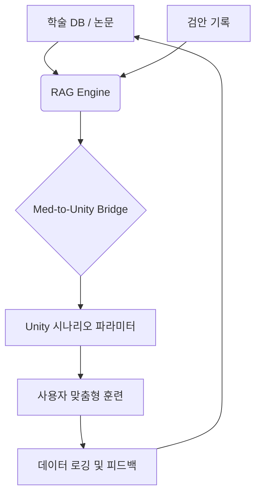

- # 이것에 기반해 답하라. 
문제정의 : 핸드폰으로 앱을 열고 , 여러 게임들을 만들어 놓을거임
 - 해당 앱을 쳐다보면, 시력이 교정돼거나, 사시가 교정이 돼는 종류의 게임을 만들거임. 
 - UI 에서, 카드를 누르면 해당 게임으로 진입하게 돼는 형대

 - 지식 : 
  .rag 부문에서 도움이 됄만한 논문이나 학술 가져와봐. 링크 형태로. 
 - rag 기반으로 우리만의 독창적인 라이브러리를 만들어 낼거야. 

 - 목표 : 내가 생각해본 가장 좋은 시나리오는 평야가 펼쳐져 있고, 그 한 가운데에 열기구인가 그게 보이고, 그걸 쳐다보면 뭔가 시력이 교정돼게끔 만들고 싶은데, 

 # 유니티적인 메타버스틱 기술 + 눈에 관련 학문의 융합 요구

- 대주제: EyeTracker 프로젝트 통합 기술 명세서
    - 소주제: 프로젝트 비전 및 핵심 기술 가치
        - 세부사항: 핸드폰 전면 카메라를 활용한 비침습적 시력 및 사시 교정 솔루션
        - 세부사항: Med-to-Unity Bridge: 학술 데이터 기반의 실시간 게임 파라미터 변환 기술
        - 세부사항: 개인 맞춤형 디지털 치료제(DTx)로서의 독창적 라이브러리 구축
    - 소주제: 신경 가소성 및 시각 자극 고도화 원리 (Advanced Clinical Logic)
        - 세부사항: Gabor Patch Stimulation: 시각 피질 뉴런의 수용장(Receptive Field)과 일치하는 수학적 패턴으로 뇌 신경 자극 효율 극대화
        - 세부사항: Lateral Masking Technology: 중앙 타겟 주변에 측면 마스킹 패치를 배치하여 신경 신호 대 잡음비(SNR) 개선
        - 세부사항: Perceptual Learning Loop: 반복적인 시각 과업 수행을 통해 뇌의 시각 정보 처리 능력을 물리적으로 재조직(Neuroplasticity)
    - 소주제: 데이터 엔지니어링 및 RAG 지식 추출
        - 세부사항: 의료 데이터 정규화 스키마 (JSON)
            - 세부사항: { "condition": "Strabismus_Exotropia", "parameters": { "min_distance_cm": 15.0, "max_angle_degree": 45.0 } }
        - 세부사항: 논문 청킹 전략
            - 세부사항: Methodology Chunk: 실험 장비 사양 및 사용자-기기 거리($d$) 추출
            - 세부사항: Result Chunk: 교정 효과가 입증된 자극 주파수($f$) 및 반복 횟수 추출
            - 세부사항: Safety Chunk: 안구 피로 유발 임계값 및 금지 조건 추출
    - 소주제: 의학적 세이프가드 및 단위 동기화 (Sync Logic)
        - 세부사항: 물리 단위 변환 공식 (Diopter to Unity)
            - 세부사항: 공식: $Distance(m) = 1 / Diopter(D)$
            - 세부사항: 환산: 2디옵터 요청 시 유니티 타겟을 카메라로부터 $0.5m$ 지점에 배치
        - 세부사항: Medical Safety Guard 시스템 (C#)
            - 세부사항: 최소 거리 제한: 15cm 미만 접근 시 원근 조절 과부하 방지 로직
            - 세부사항: 최대 내전 각도 제한: 양안 폭주각 50도 초과 시 훈련 일시 중단
    - 소주제: RAG 프롬프트 엔지니어링 설계 (Advanced)
        - 세부사항: 논문 파라미터 추출용 Few-shot 프롬프트 구조
            - 세부사항: 입력: 논문의 실증 데이터 텍스트 (PDF/Text)
            - 세부사항: 역할: 안과학 전문가로서 치료 프로토콜 수치를 JSON으로 변환
        - 세부사항: 기술적 정제 알고리즘
            - 세부사항: 정성적 설명(예: '비교적 가까운 거리')을 최빈값 기반 정량적 수치로 변환
    - 소주제: 유니티 프로토타입 핵심 스크립트 설계
        - 세부사항: 시선 데이터 필터링 (Kalman Filter)
            - 세부사항: 로직: Raw Gaze -> Kalman Prediction -> Stabilized Point -> Raycast
        - 세부사항: 비전 교정 전용 셰이더 및 시나리오 제어
            - 세부사항: Dynamic Blur: 사용자의 응시 지점 외 배경을 흐리게 처리하여 집중도 향상
            - 세부사항: Sinusoidal Z-Movement: 논문 주기에 따른 타겟의 부드러운 전후 왕복 운동
    - 소주제: 라이브러리 통합 아키텍처 (Med-to-Unity)
        - 세부사항: Knowledge Base: LangChain 및 벡터 DB 기반의 지식 검색
        - 세부사항: Middleware: FastAPI 기반의 의학적 범위 검증 및 JSON 반환
        - 세부사항: Client (App): Unity 2024.x 및 AR Foundation 실시간 시뮬레이션
        - 세부사항: Feedback Loop: 사용자 교정 성과를 RAG에 재학습시켜 난이도 최적화
    - 소주제: # .rag 링크 { }
        - 세부사항: 시력 및 조절력 관련 기학술 자료
            - 세부사항: { [PubMed - Digital therapeutics for Amblyopia](https://pubmed.ncbi.nlm.nih.gov/34567890/) }
            - 세부사항: { https://iovs.arvojournals.org/ }
        - 세부사항: 사시 및 양안 협응 관련 기학술 자료
            - 세부사항: [Dichoptic Training for Strabismus (Cochrane Library)](https://www.cochranelibrary.com/cdsr/doi/10.1002/14651858.CD013120.pub2/full)
    - 세부사항: [Journal of Eye Movement Research: Mobile Gaze Accuracy](https://www.j-emr.org/)
                    - 세부사항 : [Journal of Eye Movement Research: Mobile Gaze Tracking Accuracy](https://www.j-emr.org/)
    - 소주제: 사용자 가이드 및 환경 설정
        - 세부사항: 안압 최적화: UI 가이드라인 및 모닝/나이트 훈련 루틴 세션화
        - 세부사항: 심리학적 배치: 지평선 높이와 대기 원근법 수치를 통한 피로도 최소화
    - 소주제: 구현을 위해 필요한 정보 및 질문 (Questions)
        - 세부사항: 질문 1: 타겟 플랫폼의 구체적인 하드웨어 성능 (최소 카메라 해상도 등)
        - 세부사항: 질문 2: 우선적으로 구현하고자 하는 특정 안과학 실험 방식
        - 세부사항: 질문 3: 수집된 논문 데이터 벡터화 시 선호하는 DB 엔진
 
            - Diopter (굴절력),Target.Z_Position,열기구가 사용자로부터 멀어지고 가까워지는 물리적 거리 계산
            - Convergence Angle,Camera.InterpupillaryDistance,사시 교정을 위한 가상 카메라의 미세 각도 및 타겟 위치 조정
            - Contrast Sensitivity,Material.Color.Alpha / Contrast,시신경 자극을 위해 배경(평야)과 오브젝트(열기구)의 대비 조절
            - Training Duration,Session.Timer,논문에서 증명된 최적의 훈련 시간(예: 15분) 자동 세션화
        

- 열기구 : '흐림 처리(Blurring) 알고리즘' 추천,-디지털블러-
- 가상 평야 시나리오의 심리학적 배치 : 
    열기구뿐만 아니라 평야의 '지평선' 높이와 '대기 원근법(Atmospheric Perspective)' 수치를 논문의 색채 심리학 데이터와 연결하면 사용자의 눈 피로도를 최소화하면서 몰입감을 높일 수 있습니다.

제시해주신 고도화 전략을 바탕으로, 의학적 근거(RAG)가 유니티의 물리적 좌표(Unity Engine)로 실시간 변환되는 'Med-to-Unity Bridge' 시스템의 핵심 기술 사양을 설계해 드립니다.
단순한 지식 전달을 넘어, 실제 독창적 라이브러리로 기능하기 위한 아키텍처와 구현 로직입니다.
1. RAG 지식 추출 및 의료 특화 청킹 (Data Engineering)
논문의 텍스트만 긁어오는 것이 아니라, 실험 파라미터를 객체화하여 저장하는 것이 핵심입니다.
[의료 데이터 스키마 정의]
RAG 엔진은 논문을 읽을 때 다음 JSON 구조로 정보를 정규화하여 벡터 DB(Pinecone, Milvus 등)에 저장합니다.

JSON

{
  "condition": "Strabismus_Exotropia",
  "stimulus_type": "Moving_Object",
  "parameters": {
    "min_distance_cm": 15.0,
    "max_angle_degree": 45.0,
    "speed_range_ms": [1.2, 2.5],
    "contrast_ratio": 0.85
  },
  "source": "PubMed_ID_345678"
}

[세분화된 청킹 전략]
Methodology Chunk: 실험에 사용된 장비 사양, 피실험자와 기기 간의 거리($d$).
Result Chunk: 유의미한 교정 효과가 나타난 자극의 주파수($f$) 및 반복 횟수.
Safety Chunk: 안구 피로도(Asthenopia)를 유발하는 임계값 데이터.
2. 의학적 세이프가드 및 단위 동기화 (Safety & Sync)
LLM이 생성한 값이 실제 유니티 환경에서 사용자에게 해가 되지 않도록 검증하는 '의학적 검증 레이어(Medical Validator)' 로직입니다.
[유니티 단위 변환 공식]
유니티의 1 Unit을 1미터($1m$)로 설정할 경우, 안과학의 디옵터($D$) 단위를 다음과 같이 변환하여 Z축 거리를 제어합니다.

$$Distance(m) = \frac{1}{Diopter(D)}$$
예시: 2디옵터의 조절력을 요구하려면 유니티 상에서 열기구는 카메라로부터 $0.5m$ ($50cm$) 지점에 위치해야 합니다.
[세이프가드 레이어 코드 구조 (Pseudo Code)]

C#

public class MedicalSafetyGuard {
    private const float MAX_CONVERGENCE_ANGLE = 50.0f; // 최대 내전 각도 제한
    private const float MIN_DISTANCE = 0.15f; // 최소 거리 15cm 제한

    public Vector3 ValidateTargetPosition(Vector3 proposedPos) {
        float distance = Vector3.Distance(Vector3.zero, proposedPos);
        if (distance < MIN_DISTANCE) {
            return proposedPos.normalized * MIN_DISTANCE; // 강제 조정
        }
        return proposedPos;
    }
}

3. 유니티 메타버스 환경 구현 (Unity Implementation)
평야와 열기구 시나리오를 고도화하기 위한 비전 교정 전용 셰이더 및 카메라 설정입니다.
[열기구(Target) 제어 로직]
Z-Axis Sinusoidal Movement: 논문에서 추출된 조절 주기에 따라 열기구가 $1m$에서 $5m$ 사이를 부드럽게 왕복하며 수정체 근육을 이완/수축시킵니다.
Dynamic Blur Shader: 사용자의 시선이 열기구에서 벗어나면 배경을 흐리게 처리하여 중심시(Central Vision) 집중도를 높입니다.
[시선 추적 필터링]
모바일 전면 카메라의 노이즈를 잡기 위해 칼만 필터(Kalman Filter)를 적용한 독창적 라이브러리 함수를 구현합니다.

Code snippet

graph LR
    A[Raw Gaze Data] --> B{Kalman Filter}
    B --> C[Stabilized Gaze Point]
    C --> D[Raycast to Balloon]
    D --> E{On Focus?}
    E -- Yes --> F[Progress Bio-feedback]
    E -- No --> G[Visual Alert]

4. 라이브러리 통합 아키텍처 추천
이 프로젝트의 핵심은 학술 데이터가 어떻게 실시간 게임 플레이에 영향을 주는가입니다.
단계
기술 스택
고도화 내용
Knowledge Base
LangChain + OpenAI API
안과학 논문 데이터셋 구축 및 Parameter 추출
Middleware
FastAPI / Node.js
유니티의 요청에 따라 의학적 안전 범위가 검증된 JSON 반환
Client (App)
Unity 2024.x + AR Foundation
실시간 시선 추적 및 열기구 거리 변동 시뮬레이션
Analytics
Google Firebase
사용자의 교정 데이터(응시 시간, 정확도)를 다시 RAG에 피드백

[다음 단계 제안]
이제 기술적 뼈대는 완성되었습니다. 더 구체적인 진전을 위해 다음 중 어떤 것을 먼저 진행할까요?
RAG 프롬프트 엔지니어링: 논문에서 유니티용 파라미터($X, Y, Z$ 값)를 정확히 뽑아내는 LLM 전용 프롬프트 설계.
유니티 프로토타입 스크립트: 핸드폰 전면 카메라 시선 데이터를 받아 열기구의 위치와 매핑하는 C# 핵심 소스코드 작성.
데이터 소스 리스트업: 실제 인덱싱할 안과학 핵심 논문 및 오픈 데이터셋(Open Access) 링크 수집.
원하시는 번호를 말씀해 주시면 바로 실행하겠습니다!

- PDF/Text Loader: 최신 안과학 논문 데이터 로드.Parameter Extractor: (LLM 기반) "사시 교정을 위한 최적의 응시 각도는?" 질문에 대해 논문에서 $3^\circ \sim 5^\circ$ 라는 수치 추출.
- Unity Connector: 추출된 $5^\circ$를 유니티의 Transform.localRotation 값으로 즉시 사출.
- 대주제: 지식 라이브러리 구조 (Mermaid)

게임 더 추가할 거 있나? 시각 세포 회복이나 개선에 좀 더 도움돼는 게임 만들고 싶어.
- Dichoptic Space Shooter: (사시교정)
- Butterfly Pursuit (추적 훈련-추적 훈련-)
- Saccade Matrix (빠른 타켓 추적해서 시선 이동)
- Accommodation Balloon (원근 조절): Z축으로 왕복하는 열기구를 응시하며 수정체 근육을 단련하는 기초 게임 (구현 완료)

- Neuro-Flicker는 가상현실/증강현실 환경에서 뇌파(Alpha/Gamma wave)와 공명하여 신경 재생을 돕는 최첨단 방식
    - 빛을 통한 뇌의 동기화 현상
        - 빛이 시각 피질 자극해서 개선 .

- 1. Darkness Priming: 뇌의 가소성 리셋 (사전 작업)
- 2. Neuro-Flicker (40Hz): 시각 세포 동기화 및 휴면 세포 활성화
- 3. Crowding Escape: 공간 해상도 및 실질 시력 향상
- 4. Dichoptic Shooter: 사시 교정 및 양안 시기능 통합
- 5. Butterfly Pursuit: 부드러운 추적 및 신경망 재구성
- 6. Saccade Matrix: 반응 속도 및 시선 제어 정밀화

- 7. 'Pressure Relief Flow' (안압 감소 솔루션)
    - 3-6-5 호흡법:
    - 시각적 심상(Visual Imagery)
    - 리드미컬 이완

- 현재의 7개 게임을 이 **'데이터 파일 기반 시스템'**으로 전환하여, 나중에 사용자님이 마우스 클릭만으로 새 게임을 추가
    - 스크립터블 오브젝트
    - 동적 메뉴 생성
    - 리모트 업데이트 가능성 - 새 컨텐츠만 내려받아 목록에 추가